<div align="center">

# 🎮 Baccalauréat - Le Petit Bac

### Le jeu de lettres et de culture générale – en version mobile

[](https://flutter.dev)
[](https://dart.dev)
[](https://firebase.google.com)
[](LICENSE)

<br/>

[🎮 Jeu](#-présentation-du-jeu) • [📱 Aperçu](#-aperçu-de-lapplication) • [⚙️ Fonctionnalités](#️-fonctionnalités) • [🛠 Stack](#-stack-technique) • [🚀 Installation](#-installation) • [👨‍💻 Auteur](#-auteur)

<br/>

> 🎬 **Vidéo démo** : [Regarder sur YouTube](#) | 📱 **Télécharger l'APK** : [Releases](#)

</div>

---

## 📋 À propos

**Baccalauréat** est une application mobile inspirée du célèbre jeu du *Petit Bac*.  
Le projet a été développé avec **Flutter** et **Firebase**, **pour le fun** et dans un **objectif pédagogique**, afin de pratiquer le développement mobile et d'appliquer les acquis précédemment appris.

> ⚠️ **Projet en cours de développement** - Le mode solo est fonctionnel, le mode multijoueur arrive bientôt !

---

## 🎮 Présentation du jeu

- 🎲 Génération d'une **lettre aléatoire**
- 📝 **7 catégories** : Prénom, Pays, Ville, Animal, Fruit/Légume, Objet, Métier
- ⏱️ **Timer configurable** (30s à 180s)
- 🧮 **Calcul automatique des scores**
- 🏆 **Classement global** en temps réel

---

## 📱 Aperçu de l'application

### 🔐 Authentification

| Connexion | Inscription |
|:---:|:---:|
| 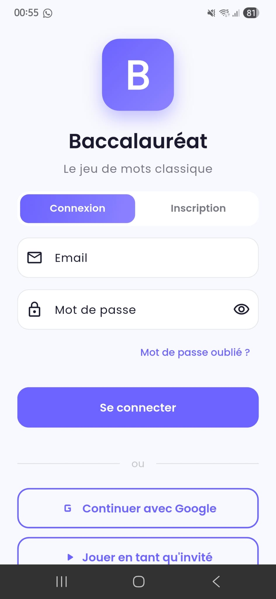 | 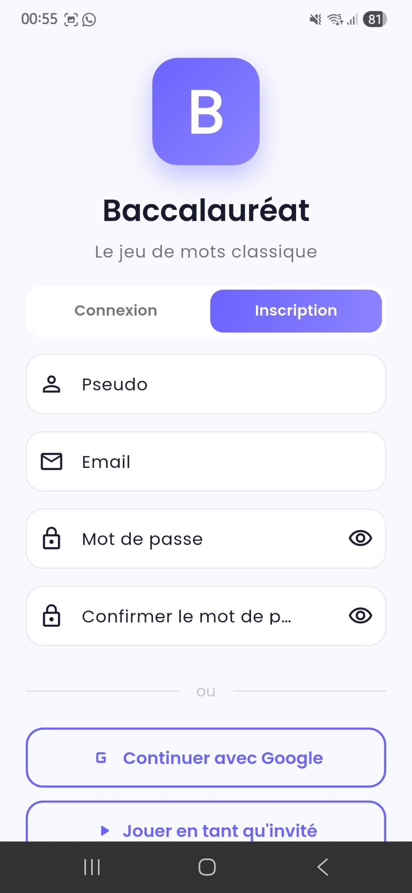 |

---

### 🏠 Tableau de bord

| Dashboard Light | Dashboard Dark |
|:---:|:---:|
| 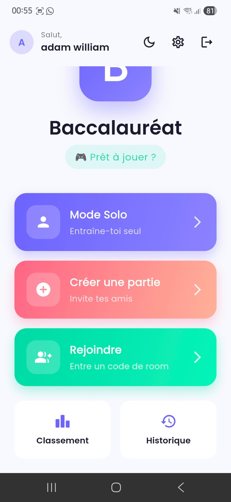 | 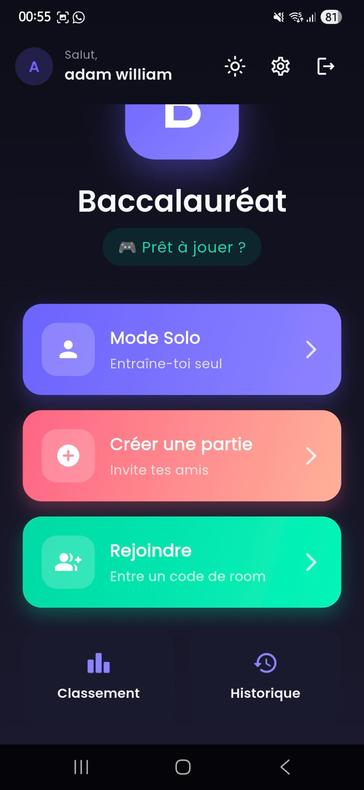 |

| Dashboard (scroll) |
|:---:|
| 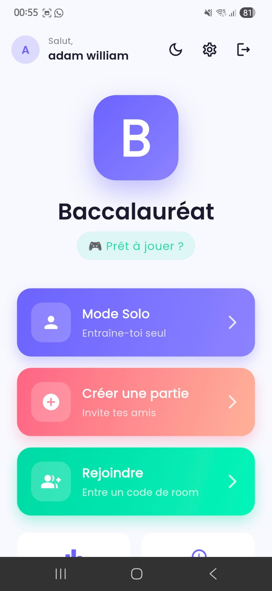 |

---

### 🎮 Jeu – Mode Solo

| Configuration partie | Lettres bannies |
|:---:|:---:|
| 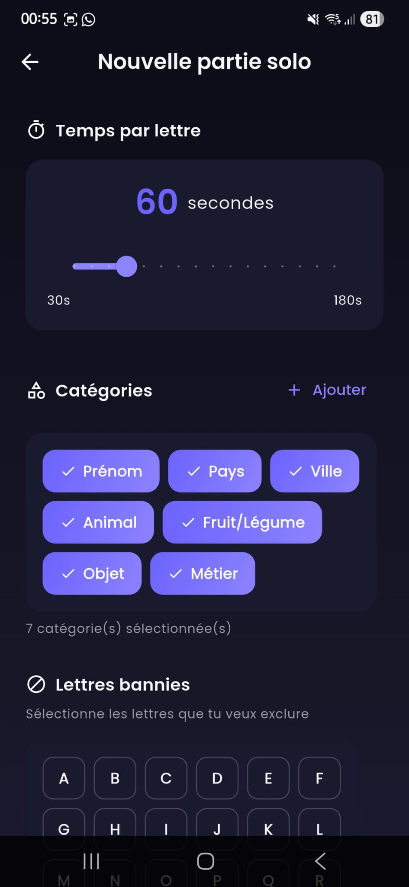 | 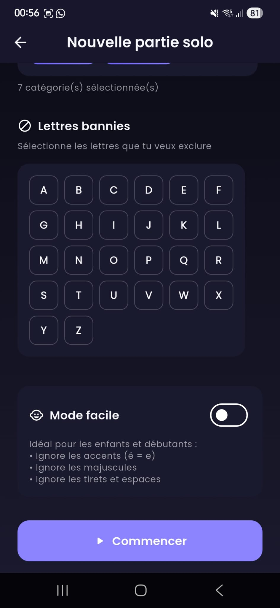 |

| Jeu en cours 1 | Jeu en cours 2 |
|:---:|:---:|
| 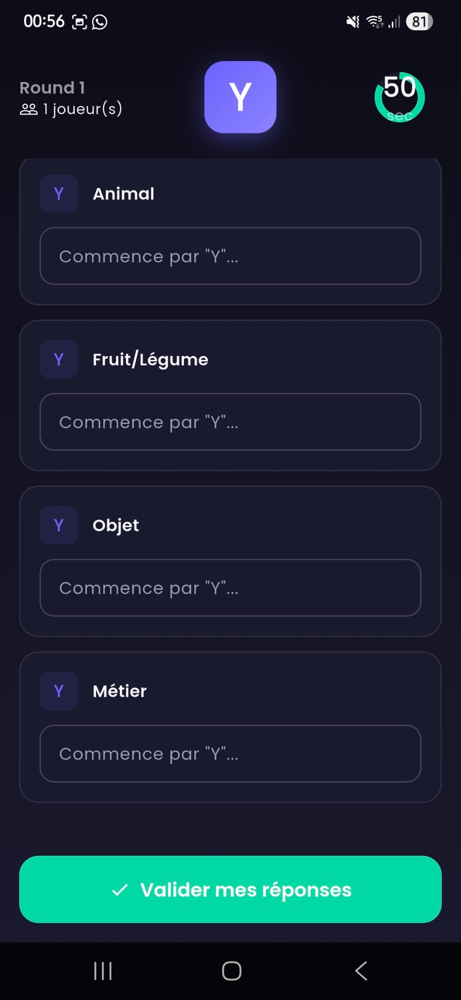 | 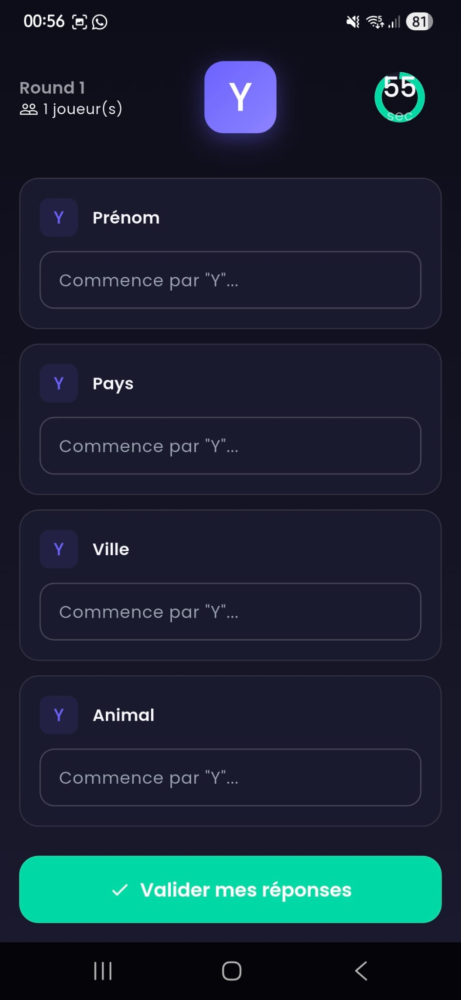 |

---

### 👥 Mode Multijoueur (🚧 En cours)

| Rejoindre une partie |
|:---:|
|  |

---

### 🏆 Classement & Historique

| Classement Global | Historique |
|:---:|:---:|
| 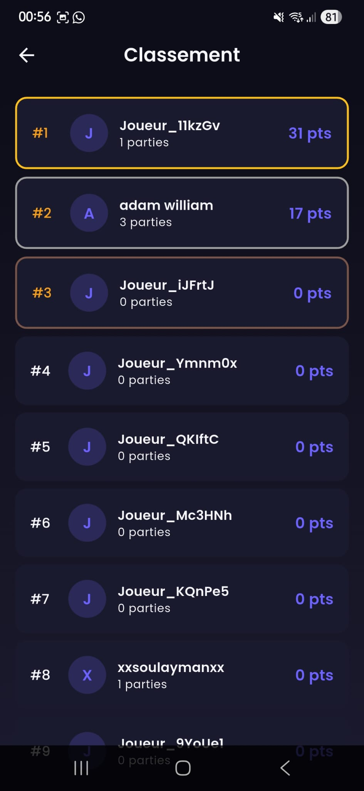 | 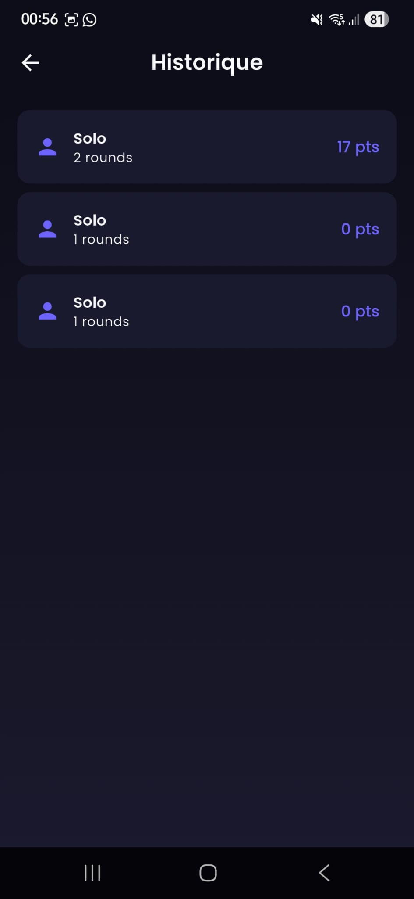 |

---

### ⚙️ Paramètres

| Paramètres |
|:---:|
| 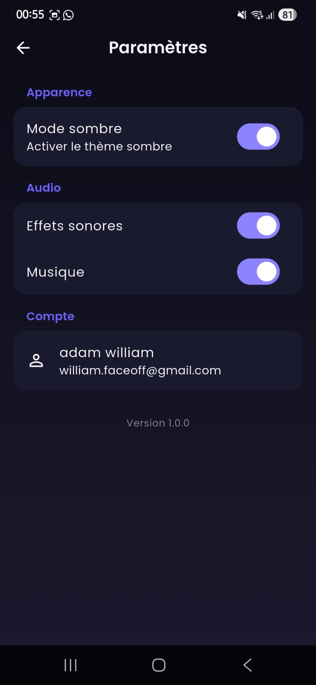 |

---

## ⚙️ Fonctionnalités

### ✅ Implémentées

| Fonctionnalité | Description |
|----------------|-------------|
| 🔐 **Authentification** | Email/Password, Google Sign-In, Mode Invité |
| 🎮 **Mode Solo** | Joue seul pour t'entraîner |
| ⏱️ **Timer Configurable** | 30s à 180s par round |
| 📝 **7 Catégories** | Prénom, Pays, Ville, Animal, Fruit/Légume, Objet, Métier |
| ➕ **Catégories Custom** | Ajoute tes propres catégories |
| 🚫 **Lettres Bannies** | Exclus les lettres difficiles (X, Y, Z...) |
| 😊 **Mode Facile** | Ignore accents, majuscules, tirets |
| 🌙 **Dark/Light Mode** | Thème sombre et clair |
| 🔊 **Audio** | Effets sonores et musique |
| 📊 **Classement Global** | Leaderboard Firestore en temps réel |
| 📜 **Historique** | Consulte tes parties passées |

### 🚧 En cours de développement

| Fonctionnalité | Statut |
|----------------|--------|
| 👥 **Mode Multijoueur** | 🔄 En cours |
| 🗳️ **Système de Vote** | 🔄 En cours |
| ✅ **Validation Réponses** | 🔄 En cours |
| 💬 **Chat en jeu** | 📋 Planifié |

---

## 🛠 Stack technique

| Technologie | Rôle |
|------------|------|
| **Flutter 3.x** | Framework UI cross-platform |
| **Dart** | Langage principal |
| **Firebase Auth** | Authentification (Email, Google, Anonyme) |
| **Cloud Firestore** | Base de données temps réel |
| **Provider** | State Management |

---

## 🏗 Architecture

```
lib/
├── main.dart
├── models/          # Modèles de données
├── screens/         # Écrans de l'app
├── services/        # Services Firebase
├── widgets/         # Composants réutilisables
└── utils/           # Utilitaires et constantes
```

---

## 🚀 Installation

### Prérequis
- Flutter SDK 3.x
- Dart SDK
- Un projet Firebase configuré

### Étapes

```bash
# Cloner le repo
git clone https://github.com/faceoff2003/baccalaureat-flutter.git
cd baccalaureat-flutter

# Installer les dépendances
flutter pub get

# Configurer Firebase (ajouter vos fichiers)
# - android/app/google-services.json
# - ios/Runner/GoogleService-Info.plist

# Lancer l'app
flutter run
```

---

## 🎯 Règles du jeu

1. Une **lettre aléatoire** est tirée
2. Tu as **X secondes** pour trouver un mot commençant par cette lettre pour chaque catégorie
3. **Points** :
    - ✅ Bonne réponse unique = **10 pts**
    - 🤝 Même réponse qu'un autre joueur = **5 pts** (multi)
    - ❌ Pas de réponse / Réponse invalide = **0 pts**
4. Le joueur avec le plus de points gagne ! 🏆

---

## 🎯 Objectif

Projet personnel réalisé pour :
- 🎓 Pratiquer Flutter & Firebase
- 💪 Consolider les acquis en développement mobile
- 📁 Enrichir mon portfolio

---

## 👨‍💻 Auteur

<div align="center">

**William Soulayman**

[](https://github.com/faceoff2003)
[](https://soulayman.be)

*Développeur Full Stack - Diplômé en Informatique de Gestion (EAFC Colfontaine, 2025)*

</div>

---

<div align="center">

### ⭐ Si ce projet vous a plu, n'hésitez pas à lui donner une étoile !

<br/>

Made with ❤️ and ☕ in Belgium 🇧🇪

</div>
